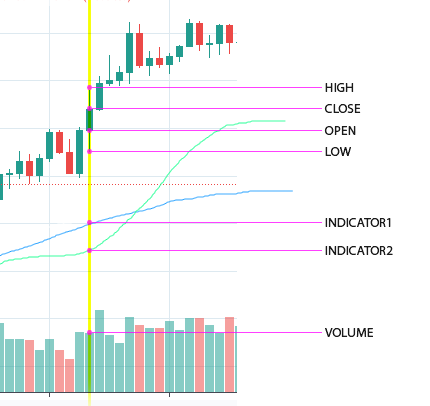
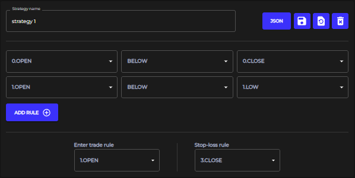
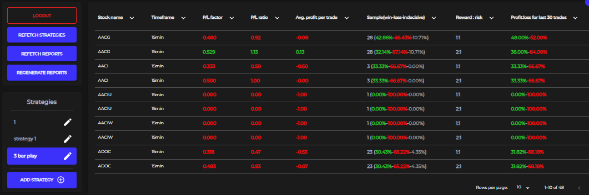
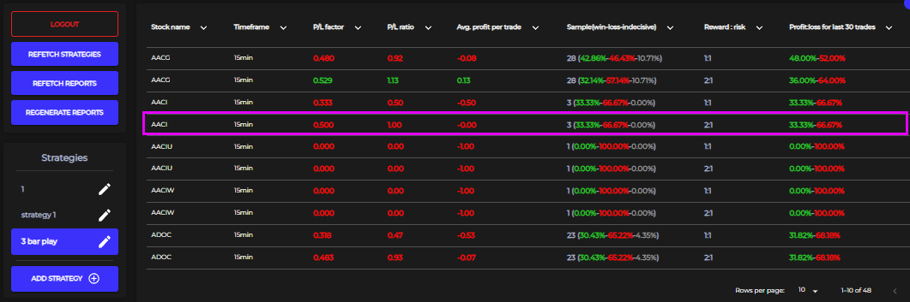
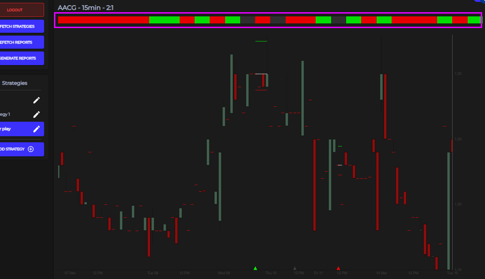

# How to use

   

# Install and Run
## Requirements:
- Node.js 12.18.3
- Npm 6.14.6
- Python 2.7.15
## Build:
- `npm run build`
## Start:
- `npm start`

   

# API - Usage and requirements (API key are used on backend)
  - APIs used for fetching:
    - Symbols - `https://api.twelvedata.com/stocks?exchange=NASDAQ`
    - Fundamentals - `https://www.alphavantage.co/query?function=OVERVIEW&symbol=${symbol}&apikey=${apikey}`
    - Vertical slice data - `https://api.twelvedata.com/time_series?&symbol=${symbol}&interval=${interval}&apikey=${apikey}&outputsize=5000`
  - Check if API keys in [api-data.ts](src/data-extractor/api-data.ts) for fetching slice data and fundamentals are still valid

   

# Terms explanation
- `Vertical slice`: model that holds value of every attribute in examined vertical line
  - vertical slice is marked yellow and holds value for all defined attributes
    
    
   

- `Strategy`: list of abstract rules that need to be satisfied in order to enter trade
  
  
   

- `Strategy report`: list of backtest results. Each strategy report is identified by strategy name that it was based on.
  
  
   

- `Backtest result`: model that holds list of entered trades for which backtesting(process of checking if strategy rules are satisfied) was passed. Each backtest has list of entered trades and is uniquely defined by combination of stock symbol, timeframe, and reward to risk ratio
  
  
   

- `Trade`: represents single trade with values and dates for entering and exiting trade. `Called 'TradeAndDateValues' but should be renamed in future`
    - Displayed list of entered trades. Each bar represents single entered trade which is shown on grpah with enter, profit, and stop loss lines:

  

